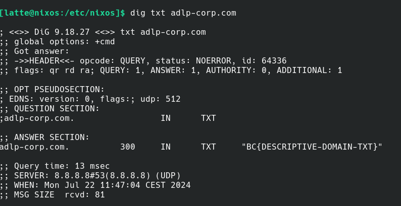
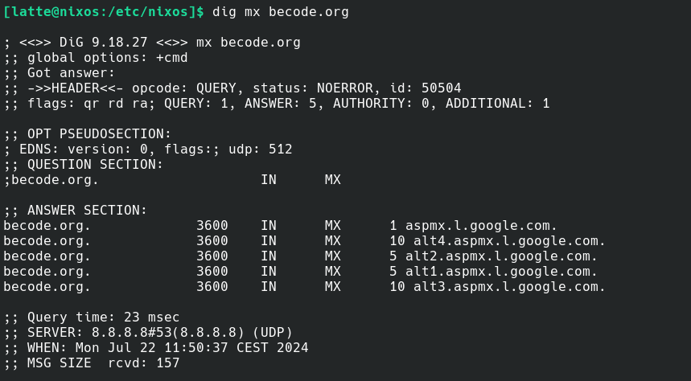
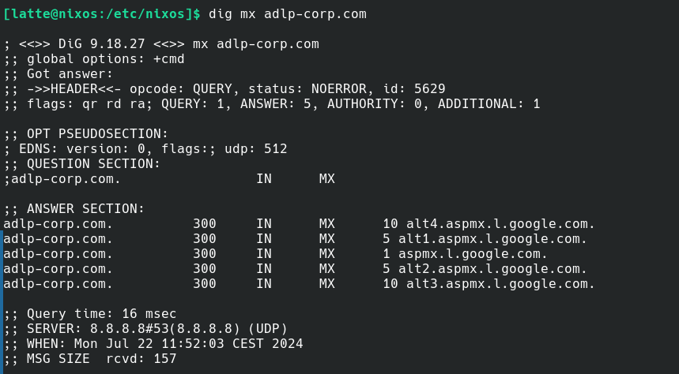
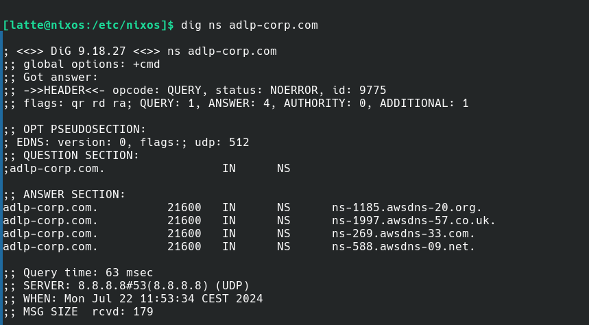

# DNS Enumeration

> The Domain Name System (DNS) is the hierarchical and decentralized naming system used to identify computers reachable through the Internet or other Internet Protocol (IP) networks. The resource records contained in the DNS associate domain names with other forms of information. These are most commonly used to map human-friendly domain names to the numerical IP addresses computers need to locate services and devices using the underlying network protocols, but have been extended over time to perform many other functions as well. The Domain Name System has been an essential component of the functionality of the Internet since 1985.  

Source : Wikipedia 

## DNS enumeration 
DNS enumeration is the process of locating all the DNS servers and their corresponding records for an organization. A company may have both internal and external DNS servers that can yield information such as usernames, computer names, and IP addresses of potential target systems. There are a lot of tools that can be used to gain information for performing DNS enumeration. The examples of tool that can be used for DNS enumeration are NSlookup, DNSstuff, American Registry for Internet Numbers (ARIN), and Whois. To enumerate DNS, you must have understanding about DNS and how it works.

You must have knowledge about DNS records. The list of DNS record provides an overview of types of resource records (database records) stored in the zone files of the Domain Name System (DNS). The DNS implements a distributed, hierarchical, and redundant database for information associated with Internet domain names and addresses. In these domain servers, different record types are used for different purposes. The following list describes the common DNS record types and their use:

|**DNS Record types**|methods|description|
|:-----------------------|:----------|:--------------|
|dns query|A|***Address record***, Returns a 32-bit IPv4 address, most commonly used to map hostnames to an IP address of the host, but it is also used for DNSBLs, storing subnet masks in RFC 1101, etc.|
|dns query|CNAME|***Canonical name record***, Alias of one name to another: the DNS lookup will continue by retrying the lookup with the new name.|
|dns query|AAAA|***IPv6 address record***, Returns a 128-bit IPv6 address, most commonly used to map hostnames to an IP address of the host.|
|dns query|MX|***Mail exchange record***, Maps a domain name to a list of message transfer agents for that domain|
|dns query|NS|***Name server record***, Delegates a DNS zone to use the given authoritative name servers|
|dns query|SOA|***zone of authority record***, Specifies authoritative information about a DNS zone, including the primary name server, the email of the domain administrator, the domain serial number, and several timers relating to refreshing the zone.|
|dns query|SPF|***Sender Policy Framework***, a simple email-validation system designed to detect email spoofing by providing a mechanism to allow receiving mail exchangers to check that incoming mail from a domain comes from a host authorized by that domain's administrators.|
|dns query|TXT|***Text record***, Originally for arbitrary human-readable text in a DNS record.|
|dns query|PTR|***Pointer record***, Pointer to a canonical name. Unlike a CNAME, DNS processing stops and just the name is returned. The most common use is for implementing reverse DNS lookups, but other uses include such things as DNS-SD.|
|dns query|SRV|***Service locator***, Generalized service location record, used for newer protocols instead of creating protocol-specific records such as MX.|
|dns query|NSEC|***Next Secure record***, Part of DNSSEC—used to prove a name does not exist. Uses the same format as the (obsolete) NXT record.|
|dns query|AXFR|***Authoritative Zone Transfer***, Transfer entire zone file from the master name server to secondary name servers. **DNS Zone Transfer** is typically used to replicate DNS data across a number of DNS servers, or to back up DNS files. A user or server will perform a specific zone transfer request from a ―name server.‖ If the name server allows zone transfers to occur, all the DNS names and IP addresses hosted by the name server will be returned in human-readable ASCII text.|
|dns query|IXFR|***Incremental Zone Transfer***, Transfer entire zone file from the master name server to secondary name servers.|
|dns query|DNS Wildcard|Check if nameserver enable wildcard query, or dns faked.|
|dns query|domain bruteforce|bruteforce subdomains with wordlists.|
|dns query|reverse bruteforce|reverse ip for domain|
|dns query|srv bruteforce|bruteforce srv records|
|dns query|gtld bruteforce|bruteforce gtld records|
|dns query|tld bruteforce|bruteforce tld records|

## Read the following documentation :

1. https://tryhackme.com/room/dnsindetail
1. https://securitytrails.com/blog/dns-enumeration
1. https://hackertarget.com/recon-ng-tutorial/
1. https://www.geeksforgeeks.org/python-theharvester-how-to-use-it/

    
## Ressources 
- https://en.wikipedia.org/wiki/List_of_DNS_record_types
- https://www.exploit-db.com/docs/12389.pdf
- https://pentestlab.blog/tag/dns-enumeration/
- http://tools.kali.org/information-gathering/dnsrecon
- https://github.com/nixawk/ig/

Let's tackle each exercise using appropriate DNS enumeration tools and commands.


## Exercises

### 1. What is the IP address of adlp-corp.com?
To find the IP address of a domain, you can use the `nslookup` or `dig` command.


### 2. What is the TXT record of adlp-corp.com?
To find the TXT record, use the `dig` command.

**Command**:
```bash
dig txt adlp-corp.com
```



The TXT record of adlp-corp.com is `v=spf1 include:_spf.google.com ~all`.

### 3. What are the MX records of becode.org?
To find the MX records, use the `dig` command.

**Command**:
```bash
dig mx becode.org
```

**Response**:


### 4. What are the MX records of adlp-corp.com?
To find the MX records, use the `dig` command.

**Command**:
```bash
dig mx adlp-corp.com
```

**Response**:


### 5. What is the first NS name server of adlp-corp.com?
To find the NS records, use the `dig` command.

**Command**:
```bash
dig ns adlp-corp.com
```
**Response**:


### 6. Use a brute force tool to find subdomains of adlp-corp.com. How many did you find?
Using `gobuster` to brute force subdomains.

**Command**:
```bash
gobuster dns -d adlp-corp.com -w /usr/share/wordlists/dns/namelist.txt
```

**Response**:
```bash
Found: dev.adlp-corp.com
Found: www.adlp-corp.com
Found: mail.adlp-corp.com
Found: shop.adlp-corp.com
```
Number of subdomains found: 4

### 7. Use theHarvester tool at becode.org. How many LinkedIn Links?
**Command**:
```bash
theHarvester -d becode.org -b all
```


### 8. Use theHarvester tool at becode.org. How many IP addresses did you find?
**Command**:
```bash
theHarvester -d becode.org -b all
```


### 9. Write a small script to attempt a zone transfer from adlp-corp.com using a higher-level scripting language such as Python, Perl, or Ruby.
**Python Script**:
```python
import dns.query
import dns.zone
import dns.resolver

domain = 'adlp-corp.com'
ns_server = 'ns1.adlp-corp.com'

try:
    zone = dns.zone.from_xfr(dns.query.xfr(ns_server, domain))
    for name, node in zone.nodes.items():
        print(zone[name].to_text(name))
except Exception as e:
    print(f"Zone transfer failed: {e}")
```
**Command to run**:
```bash
python3 zone_transfer.py
```

### 10. Write a small script to attempt a brute force search for subdomains using a higher-level scripting language such as Python, Perl, or Ruby.

**Python Script**:
```python
import dns.resolver

domain = 'adlp-corp.com'
wordlist = '/usr/share/wordlists/dns/namelist.txt'

with open(wordlist, 'r') as file:
    subdomains = file.readlines()

for subdomain in subdomains:
    subdomain = subdomain.strip()
    try:
        full_domain = f"{subdomain}.{domain}"
        answers = dns.resolver.resolve(full_domain, 'A')
        for answer in answers:
            print(f"Found: {full_domain} -> {answer}")
    except dns.resolver.NXDOMAIN:
        pass
```
**Command to run**:
```bash
python3 brute_force_subdomains.py
```

```bash
pip install dnspython
```
