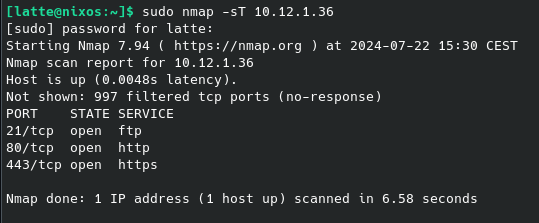

# Nmap

Nmap (Network Mapper) is a network scanner created by Gordon Lyon (also known by his pseudonym Fyodor Vaskovich). Nmap is used to discover hosts and services on a computer network by sending packets and analyzing the responses.

Nmap provides a number of features for probing computer networks, including host discovery and service and operating system detection. These features are extensible by scripts that provide more advanced service detection, vulnerability detection, and other features. Nmap can adapt to network conditions including latency and congestion during a scan.

Source Wikipedia :  https://en.wikipedia.org/wiki/Nmap


## 1. Discover how nmap works by following this room on try hack me.

https://tryhackme.com/room/furthernmap

## 2. Connect to the vpn and use the 10.12.1.36 to answer the following questions:

Ip : 10.12.1.36

1. How many tcp ports are open on the box? What command did you use?
   
   `sudo nmap -sT 10.12.1.36 `

   

2. How many udp ports are open on the box? What command did you use?

   `sudo nmap -sU 10.12.1.36`


3. What is the version of ftp?
   
   `nmap -sV -p 21 10.12.1.36`

4. What is the version of ssh?
   `nmap -sV -p 22 10.12.1.36`

5. What is the version of Apache?
   
   `nmap -sV -p 80,443 10.12.1.36`

6. Is anonymous ftp access allowed on the box? What command did you use? (Use only nmap)
   
   `nmap -p 21 --script ftp-anon 10.12.1.36`

7. Do a SYN scan. Which command did you use?
 
   `sudo nmap -sS 10.12.1.36`

8. Do a scan that bypasses a firewall. What command did you use?

   `sudo nmap -sA 10.12.1.36`

9. Run a scan with the default NSE scripts. Which flag do you use?
  
   `nmap -sC 10.12.1.36`

10.  What service occupies port 8180?

      `nmap -sV -p 8180 10.12.1.36`

11.  What is the salt of the mysql service?
   
      `nmap --script mysql-info 10.12.1.36`

12.  What is the domain name ?

      `nmap --script dns-service-discovery 10.12.1.36`

13.  What is the FQDN of the box ? 
   
      `nmap --script dns-service-discovery 10.12.1.36`

14.  What is the os version ? 
   
       `nmap -O 10.12.1.36`

15.  What is the version of Samba ?
   
      `nmap -p 139,445 --script smb-os-discovery 10.12.1.36`

16.  Wat is the name of the box ?
     
      `nmap -sP 10.12.1.36`

17.  Do a scan on the subnet 10.xx.1.0/24. How many IP addresses respond?  What command did you use?
   Charleroi : 10.11.0.1/24
   Bruxelles : 10.12.0.1/24
   Ghent : 10.13.0.1/24

      ```
      nmap -sn 10.11.1.0/24  # For Charleroi
      nmap -sn 10.12.1.0/24  # For Bruxelles
      nmap -sn 10.13.1.0/24  # For Ghent
      ```

18. Do the same thing but with the top port option at 10. What command did you use?
      ```
      nmap --top-ports 10 10.11.1.0/24  # For Charleroi
      nmap --top-ports 10 10.12.1.0/24  # For Bruxelles
      nmap --top-ports 10 10.13.1.0/24  # For Ghent
      ```
      The --top-ports 10 scans the top 10 most common ports.

