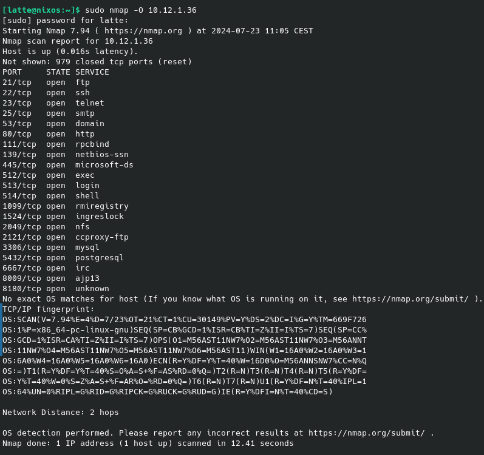
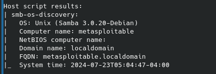
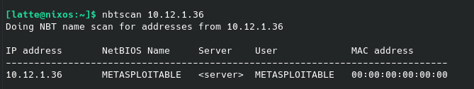
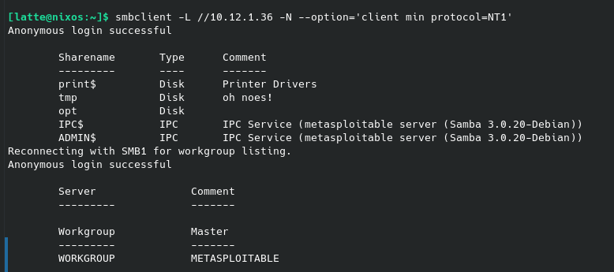
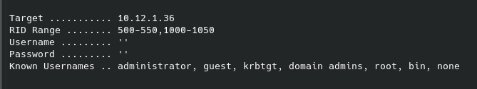

# Samba enumeration 

## What is a Samba server?
A Samba server is characterized as such when a suite of free software is used to share resources between systems that are incompatible by nature. The GNU General Public License allows the implementation of the Server Message Block (SMB) protocol, which gave the name to the Samba suite, in the Linux and Unix operating systems.  This resource sharing protocol (SMB), also known in its more recent version as CIFS for Common Internet File System, was originally used as a Windows local area network to establish interactions with file servers, printers and other services. With such an implementation computers under Windows, Linux and Unix can be connected so that they can exchange data or jointly use printers and other services. It doesn't matter whether the server is installed under Linux or Unix, because the fourth version of the software supports the role of Active Directory Domain Controllers, through which a central authorization and authentication of individual computers and users is possible. 

## Read this documentation 
https://www.hackingarticles.in/a-little-guide-to-smb-enumeration/

## Exercises 

- **Important : Important: you must be connected to the vpn**

- Do the following exercises without authentication.
- There are many tools to get the same answers. It doesn't matter which tool, the important thing is the answer.

## IP : 10.12.1.36

1. What is the OS ?

     `nmap -O 10.12.1.36`

     
      
      **OS:x86_64-pc-linux-gnu**

2. What is the version of samba on the box? 

    `nmap --script smb-os-discovery 10.12.1.36`

     

    **Samba version: 3.0.20-Debian**

3. How many group names are there? (use nbtstat)
  
    `nbtscan 10.12.1.36`

      

4. What is the FQDN ?
    
    `nmap --script smb-os-discovery 10.12.1.36`

     **FQDN: metasploitable.localdomain**

5. What is the Netbios computer name. 
    
    `nbtscan 10.12.1.36`

     **METASPLOITABLE**

6. How many disks are shared?

    `smbclient -L //10.12.1.36 -N --option='client min protocol=NT1'`

     

     **3 disks are shared (print$, tmp, and opt are listed as "Disk" type shares)**
7. Which one is available for reading and writing? 
    
     Based on the output, the 'tmp' share is likely available for reading and writing.
    (The comment "oh noes!" suggests it might be openly accessible, but to confirm this, we'd need to attempt to connect to it)

8. What flag did you find when you logged in?
    
    `smbclient //10.12.1.36/share_name -N`

9.  What is the path that begins with ``c:\`` in this file?
    
    `smbclient //10.12.1.36/share_name -N`

10.  How many users can you find ?
    
        `enum4linux -U 10.12.1.36`

       
